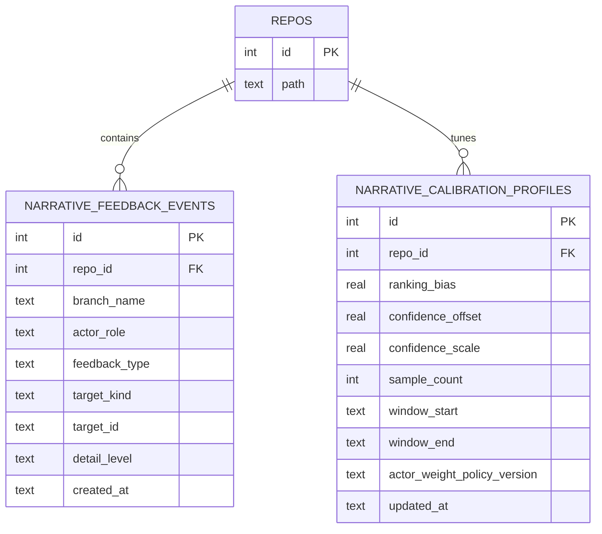

# feat: Narrative Truth Loop Feedback Calibration

## Table of Contents
- [Enhancement Summary](#enhancement-summary)
- [Section Manifest](#section-manifest)
- [Overview](#overview)
- [Problem Statement / Motivation](#problem-statement--motivation)
- [Research Consolidation](#research-consolidation)
- [Proposed Solution](#proposed-solution)
- [Technical Considerations](#technical-considerations)
- [System-Wide Impact](#system-wide-impact)
- [Data Model (Proposed)](#data-model-proposed)
- [SpecFlow Analysis (Gap & Edge-Case Pass)](#specflow-analysis-gap--edge-case-pass)
- [Acceptance Criteria](#acceptance-criteria)
- [Success Metrics](#success-metrics)
- [Dependencies & Risks](#dependencies--risks)
- [Phased Delivery (Implementation Suggestion)](#phased-delivery-implementation-suggestion)
- [Sources & References](#sources--references)

## Enhancement Summary

**Deepened on:** 2026-02-24  
**Sections enhanced:** 11  
**Research methods used:** local skill scan from `~/.agents/skills`, Context7 framework docs (React, Tauri, Vitest), web primary-source docs (SQLite, React, Tauri, SRE rollout guidance).

### Key Improvements
1. Added bounded calibration policy requirements (clamps, minimum sample floors, idempotency, cold-start neutrality).
2. Added concrete persistence/index/query-plan guidance for repo-local feedback storage.
3. Added rollout hardening guidance (canary + kill-switch behavior) without expanding v1 scope beyond brainstorm decisions.

### New Considerations Discovered
- Optimistic feedback UX must be transition-safe so urgent updates are not blocked.
- Event-storage indexing strategy must be designed up front to avoid write-path regressions.
- Calibration must be independently disableable (kill switch) while preserving baseline narrative rendering.

## Section Manifest

Section 1: Problem/goal contract — trust and fallback reduction target.  
Section 2: Solution boundaries — carry-forward of brainstorm decisions and non-goals.  
Section 3: Technical/system impact — command surface, telemetry, failure behavior, and observability chain.  
Section 4: Data model and quality gates — feedback event schema, profile derivation, indexing, idempotency.  
Section 5: Validation and rollout — cross-layer scenarios, canary strategy, measurable success criteria.

## Overview
Add a **Narrative Truth Loop** that captures explicit human feedback on branch narratives and uses it to improve future narrative quality at the **repo scope** (see brainstorm: `docs/brainstorms/2026-02-24-narrative-truth-loop-brainstorm.md`).

V1 scope is intentionally bounded:
- feedback actors: developer + reviewer/manager,
- feedback actions: `Wrong` / `Key` (per highlight) + `Missing decision` (branch-level),
- feedback effect: adjust **highlight ranking** + **confidence calibration**,
- no global/cross-repo learning,
- no direct rollout-threshold mutation (see brainstorm origin).

### Research Insights
- Keep v1 deterministic and additive over current narrative paths; do not replace baseline scoring logic with opaque adaptive systems yet.
- Preserve “agent-native parity” by making feedback transformations inspectable end-to-end.

## Problem Statement / Motivation
Current narrative generation is deterministic and static per render cycle. It has telemetry and fallback mechanisms, but no explicit user correction loop. This creates a trust ceiling: users can identify weak highlights but cannot teach the system to improve for future branches.

The highest-value outcome is lower fallback-to-raw-diff behavior after users view summary/evidence. That directly aligns to product thesis (“comprehension via abstraction”) and keeps safety rails intact through bounded updates (see brainstorm origin).

### Research Insights
- Rollout of trust-sensitive behavior should use canary-style progressive exposure and explicit rollback triggers.
- Feature-flag guidance supports independent disablement of calibration without disabling narrative baseline functionality.

## Research Consolidation
### Brainstorm foundation (within 14 days)
Found and used: `docs/brainstorms/2026-02-24-narrative-truth-loop-brainstorm.md` (2026-02-24).

### Local repo patterns
- Narrative generation: `src/core/narrative/composeBranchNarrative.ts:108`
- Rollout scoring/kill-switch rubric: `src/core/narrative/rolloutGovernance.ts:39`
- Narrative UI controls: `src/ui/components/BranchNarrativePanel.tsx:49`
- Narrative orchestration + telemetry events: `src/ui/views/BranchView.tsx:306`, `:660`, `:673`, `:692`
- Telemetry event schema: `src/core/telemetry/narrativeTelemetry.ts:3`
- Existing confidence persistence precedent (session links): `src-tauri/src/session_links.rs:81`

### Skills discovery and application (`~/.agents/skills`)
Matched and applied guidance from:
- `writing-plans`
- `react-best-practices`
- `security-best-practices`
- `agent-native-architecture`
- `llm-design-review`
- `product-design-review`
- `frontend-ui-design`
- `context7`

### Learnings/Solutions scan
Relevant project learning applied:
- `docs/solutions/integration-issues/codex-app-server-claude-otel-stream-reliability-auth-migration-hardening.md`

Carried forward patterns:
- deterministic transitions over hidden state changes,
- measurable fallback behavior,
- explicit release-blocking reliability tests for sensitive paths.

### Review-agent discovery
Checked project and user agent folders (`agents/`, `codex/agents/`, `~/.codex/agents/`) and agent wiring in `~/.codex/config.toml`; no additional local markdown review prompts were present in those directories for direct file-driven execution, so deepening proceeded with local research + framework docs + primary-source review.

## Proposed Solution
Implement a repo-local feedback loop with two layers:

1. **Feedback capture layer**
   - Add lightweight feedback actions in narrative UI.
   - Persist feedback events with actor role, target, and timestamp.

2. **Calibration layer**
   - Ranking calibration: bounded per-repo weight adjustments over existing highlight heuristics.
   - Confidence calibration: bounded offset/scaling based on observed feedback quality signals.

### Locked v1 implementation decisions
- **Persistence backend (resolved):** use `sqlite:narrative.db` as the source of truth for feedback events and derived calibration profiles.
- **Out of scope for v1 persistence:** `.narrative/meta` may be used for future export/debug artifacts, but not as canonical storage.

### Scope boundaries (hard constraints)
- V1 applies only to branch narrative highlight ordering and confidence value (see brainstorm origin).
- No free-form mandatory text in v1.
- No cross-repo model/profile sharing.
- No silent rollout-governance threshold edits by calibration.

### Research Insights
**Best Practices**
- Apply calibration only after minimum-sample thresholds are met.
- Keep default profile neutral (`no feedback => baseline behavior`).
- Clamp all derived adjustments to bounded ranges.

**Implementation Direction (v1-safe)**
- Use event-sourced feedback inputs + derived per-repo profile.
- Treat `Missing decision` as confidence caution input, not direct kill-switch trigger.

## Technical Considerations
- **Architecture impacts:** additive path over existing `composeBranchNarrative` and `BranchNarrativePanel` flows; no rewrite.
- **Performance implications:** feedback write must be async and non-blocking for UI; calibration lookup should be O(1)/cached per repo session.
- **Security/privacy:** feedback stores role + event metadata only; avoid secrets/PII by design; maintain local-first storage posture.
- **Explainability:** expose calibration provenance in debug telemetry/logs to avoid opaque behavior.

### Research Insights
**React/UI behavior**
- Transition-safe updates (`useTransition`) and optimistic interaction patterns (`useOptimistic`) should be used carefully for immediate UI acknowledgement without blocking urgent interactions.
- Keep feedback action latency low and avoid interaction flicker.

**Tauri security**
- Preserve least-privilege permissions in capability files when adding any new command pathway.
- Avoid broad SQL permission expansion when narrower command-scoped permissions suffice.

**Test stability**
- Use Vitest + MSW request mocking for deterministic integration-style behavior tests of persistence success/failure states.

## System-Wide Impact
- **Interaction graph:**
  - User clicks feedback in `BranchNarrativePanel` → handler in `BranchView` → persistence API (Tauri/DB or `.narrative` file) → calibration selector in narrative compose path → updated highlight order/confidence on next render.
- **Error propagation:**
  - Persistence failure must degrade to non-blocking toast/log; narrative rendering continues with base heuristics.
  - Calibration read failure falls back to neutral coefficients (no behavior regression).
- **State lifecycle risks:**
  - Duplicate feedback spam, stale calibration after unlink/history rewrite, role ambiguity.
  - Mitigate with idempotency keys, bounded windows, and recalculation triggers.
- **API surface parity:**
  - Keep parity across UI interactions and telemetry event contracts; expand telemetry enums for feedback events.
- **Integration test scenarios:**
  1. feedback persisted + reflected in subsequent ranking,
  2. feedback persistence failure does not break narrative view,
  3. repo switch isolates calibration,
  4. branch-level “missing decision” increases caution in confidence but not hard rollback,
  5. fallback metric decreases over repeated corrected interactions in fixture flow.

### Research Insights
- Require traceable event pairings (`feedback_submitted` → changed narrative score output) for observability.
- Explicit retry/backoff policy is required to avoid duplicate-write inflation under transient failure.

## Data Model (Proposed)
Use one event table + one derived calibration profile table (or equivalent persisted files with same logical schema).

### Research Insights
- Add dedupe/idempotency strategy (idempotency key or equivalent uniqueness policy) so repeated click bursts do not corrupt profile math.
- Add index plan aligned to query paths:
  - `(repo_id, created_at)` for trend windows,
  - `(repo_id, target_id, feedback_type)` for per-highlight aggregation.
- Validate query plans with `EXPLAIN QUERY PLAN` and avoid over-indexing write-heavy event streams.
- For profile upserts, use explicit conflict targets and deterministic update formulas.
- Keep calibration profile metadata explainable (`sample_count`, active window bounds, weighting-policy version) so score changes can be audited.

## SpecFlow Analysis (Gap & Edge-Case Pass)
### Key user flows
- Submit highlight feedback (Wrong/Key).
- Submit branch-level “Missing decision”.
- Re-open same branch and observe adjusted ranking/confidence.

### Gaps to close in plan
- actor role source-of-truth (session user role vs selected UI role),
- bounded calibration math and clamping rules,
- stale feedback invalidation policy after major branch rewrite.

### Edge cases
- conflicting feedback on same highlight,
- low-volume repos with sparse feedback,
- new repo with no profile,
- deleted/renamed highlight IDs across recompute.

### SpecFlow-driven additions
- add idempotency and dedupe acceptance criteria,
- add cold-start behavior criteria,
- add fixture-based trend test for fallback metric movement.

### Research Insights
- Add actor spoofing guard: role attribution validated against runtime identity context.
- Add retention-window logic: old events should age out from active calibration windows.
- Add ID drift strategy: remap by evidence-link equivalence when highlight IDs churn.

## Acceptance Criteria
- [x] Add feedback actions in `src/ui/components/BranchNarrativePanel.tsx` for `Wrong`, `Key`, and `Missing decision` (see brainstorm origin).
- [x] Add orchestration handlers in `src/ui/views/BranchView.tsx` that persist feedback and emit telemetry.
- [x] Add persistence contract for repo-local feedback events and calibration profile (new table(s) or equivalent local narrative metadata contract).
- [x] Update narrative generation path in `src/core/narrative/composeBranchNarrative.ts` to apply bounded ranking + confidence calibration (see brainstorm origin).
- [x] Keep rollout governance thresholds unchanged in v1; only inputs may change via confidence/evidence effects (see brainstorm origin).
- [x] Extend telemetry schema in `src/core/telemetry/narrativeTelemetry.ts` with feedback event names and payload fields.
- [x] Add a denominator telemetry event (for example `narrative_viewed`) so fallback-rate KPI is mathematically well-defined.
- [x] Add/extend tests in:
  - `src/ui/components/__tests__/BranchNarrativePanel.test.tsx`
  - `src/ui/views/__tests__/BranchView.test.tsx`
  - `src/core/narrative/__tests__/composeBranchNarrative.test.ts`
  - `src/core/narrative/__tests__/rolloutGovernance.test.ts`
  - new persistence tests under `src-tauri/src/...` or `src/core/repo/...` depending on storage choice.
- [x] Ensure failure mode: persistence/calibration errors never block baseline narrative render or raw diff fallback.
- [x] Enforce idempotent feedback writes (duplicate submissions do not inflate calibration).
- [x] Enforce cold-start neutrality (no feedback => baseline outputs).
- [x] Enforce calibration clamps via tests (no out-of-policy adjustments).
- [x] Add a calibration feature flag / kill switch path separate from baseline narrative path.
- [x] Enforce retry policy for transient persistence failures (max 2 retries with bounded exponential backoff), and verify retries do not violate idempotency semantics.
- [x] Add a Phase 1 decision gate artifact documenting SQLite schema + indexes + migration verification before calibration logic is enabled.

## Success Metrics
Primary (from brainstorm):
- **Fallback reduction:** decrease `fallback_used` events per narrative session after rollout (see brainstorm origin).

**Primary KPI contract (locked):**
- Metric: `fallback_rate = fallback_used / narrative_viewed`.
- Baseline: 14-day pre-enable rolling window for opted-in repos.
- Target: ≥20% relative reduction in `fallback_rate` by day 14 after enablement.
- Guardrail: no >5% increase in `kill_switch_triggered` rate over the same comparison windows.

Secondary:
- `Key:Wrong` feedback ratio trend by repo,
- confidence calibration error reduction (proxy: fewer low-confidence-but-user-key contradictions),
- no increase in kill-switch-triggered narrative rollbacks caused by calibration,
- feedback interaction latency p95 remains within acceptable UI budget.

### Research Insights
- Evaluate on daily and 7-day rolling windows to avoid noisy decisions.
- Add trend break detection for sudden fallback spikes after calibration rollout.

## Dependencies & Risks
### Dependencies
- existing narrative telemetry pipeline,
- repo context (`repoId`, branch metadata),
- SQLite migration + index rollout for feedback/calibration tables.

### Risks
- **Overfitting to noisy feedback** → clamp updates + minimum sample threshold.
- **Role misuse/inconsistency** → derive role from authenticated UI context, not free-text.
- **Storage drift** → schema version + migration test.
- **Trust regressions** → canary flag + quick disable path.
- **Index bloat / write drag** → index only proven query paths and review with query-plan evidence.

## Phased Delivery (Implementation Suggestion)
### Phase 1 — Capture contract
- UI actions + telemetry + event persistence.
- File targets:
  - `src/ui/components/BranchNarrativePanel.tsx`
  - `src/ui/views/BranchView.tsx`
  - `src/core/telemetry/narrativeTelemetry.ts`
  - `src-tauri/src/lib.rs` (+ migration and indexes)

**Phase 1 quality gates**
- feedback action UX remains responsive under simulated write latency,
- duplicate click behavior is idempotent,
- new telemetry events conform to schema.
- persistence decision gate passed: migration applied, indexes validated, and query plans reviewed.

### Phase 2 — Calibration application
- Introduce bounded ranking/confidence transforms and default neutral profile.
- File targets:
  - `src/core/narrative/composeBranchNarrative.ts`
  - `src/core/types.ts`
  - optional selector/helpers under `src/core/narrative/`

**Phase 2 quality gates**
- clamp and sample-floor logic fully covered by tests,
- sparse/no-feedback repos remain behaviorally stable,
- calibrated outputs are explainable via stored profile coefficients.

### Phase 3 — Validation + rollout guardrails
- Fixture and integration assertions for trend behavior and safe degradation.
- Validate with:
  - `pnpm lint`
  - `pnpm typecheck`
  - `pnpm test`
  - `pnpm test:integration`

**Phase 3 quality gates**
- calibration path enabled via phased local rollout (feature flag default-off; opt-in repo cohort first, then broaden),
- fallback trend reviewed before wider enablement,
- kill-switch drill proves immediate return to baseline narrative behavior.

## Sources & References
- **Origin brainstorm:** [`docs/brainstorms/2026-02-24-narrative-truth-loop-brainstorm.md`](/Users/jamiecraik/dev/firefly-narrative/docs/brainstorms/2026-02-24-narrative-truth-loop-brainstorm.md)
  - Carried-forward decisions: dual-role feedback actors; ranking+confidence scope; per-repo learning only; fallback reduction as primary KPI.
- Similar implementations:
  - `src/core/narrative/composeBranchNarrative.ts:69`
  - `src/core/narrative/rolloutGovernance.ts:39`
  - `src/ui/views/BranchView.tsx:660`
  - `src/core/telemetry/narrativeTelemetry.ts:3`
  - `src-tauri/src/session_links.rs:81`
- Institutional learning:
  - `docs/solutions/integration-issues/codex-app-server-claude-otel-stream-reliability-auth-migration-hardening.md`
- Phase 1 decision gate artifact:
  - `/Users/jamiecraik/dev/firefly-narrative/docs/plans/2026-02-24-narrative-truth-loop-phase1-sqlite-decision-gate.md`

### External references (deepening pass)
- React `useTransition`: [https://react.dev/reference/react/useTransition](https://react.dev/reference/react/useTransition)
- React `useOptimistic`: [https://react.dev/reference/react/useOptimistic](https://react.dev/reference/react/useOptimistic)
- React 19 (`useOptimistic` release context): [https://react.dev/blog/2024/12/05/react-19](https://react.dev/blog/2024/12/05/react-19)
- Vitest request mocking (MSW): [https://vitest.dev/guide/mocking/requests](https://vitest.dev/guide/mocking/requests)
- Tauri capabilities: [https://v2.tauri.app/es/security/capabilities/](https://v2.tauri.app/es/security/capabilities/)
- Tauri permissions: [https://v2.tauri.app/es/security/permissions/](https://v2.tauri.app/es/security/permissions/)
- Tauri SQL plugin docs: [https://github.com/tauri-apps/tauri-docs/blob/v2/src/content/docs/plugin/sql.mdx](https://github.com/tauri-apps/tauri-docs/blob/v2/src/content/docs/plugin/sql.mdx)
- SQLite partial indexes: [https://sqlite.org/partialindex.html](https://sqlite.org/partialindex.html)
- SQLite UPSERT: [https://www2.sqlite.org/lang_UPSERT.html](https://www2.sqlite.org/lang_UPSERT.html)
- SQLite EXPLAIN QUERY PLAN: [https://sqlite.org/eqp.html](https://sqlite.org/eqp.html)
- Google SRE canarying releases: [https://sre.google/workbook/canarying-releases/](https://sre.google/workbook/canarying-releases/)
- LaunchDarkly flag creation guidance: [https://launchdarkly.com/docs/guides/flags/creating-flags](https://launchdarkly.com/docs/guides/flags/creating-flags)
