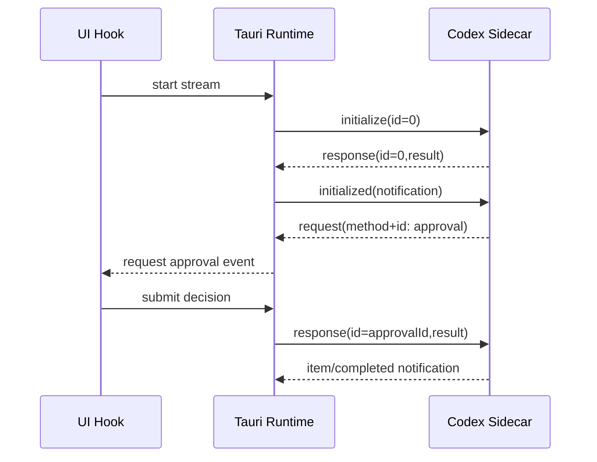
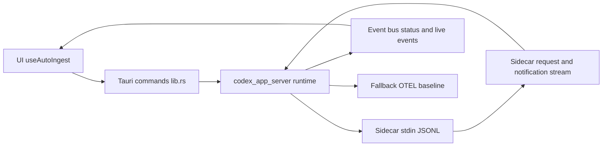
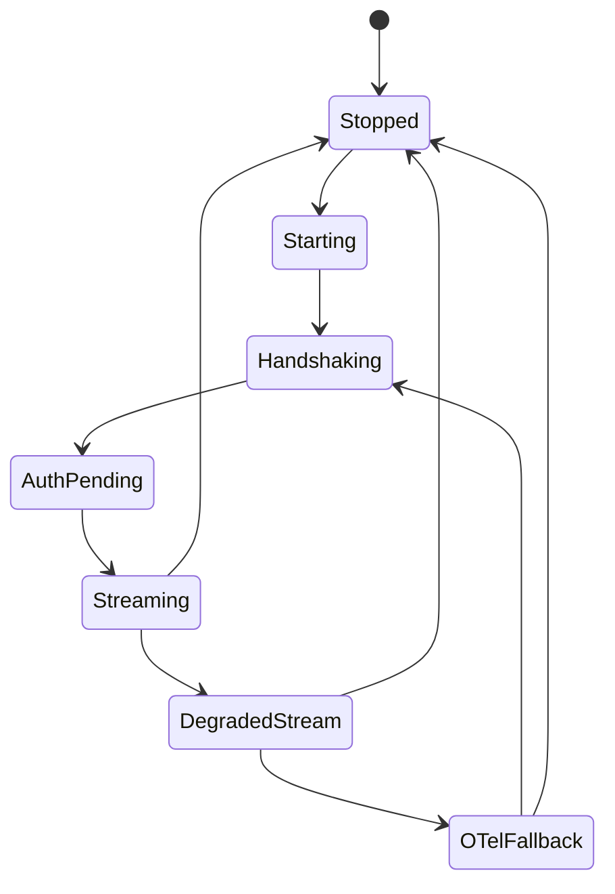

# fix: Codex app-server protocol parity gaps

## Enhancement Summary

**Deepened on:** 2026-02-27  
**Sections enhanced:** 14 major sections + acceptance criteria and quality gates  
**Research inputs used:**
- Local learning: `docs/solutions/integration-issues/codex-app-server-claude-otel-stream-reliability-auth-migration-hardening.md`
- OpenAI Codex app-server docs + protocol schemas
- JSON-RPC 2.0 specification
- Tauri sidecar + shell plugin documentation
- Parallel review/research agents (`explorer`, `diagram-cli`)

### Key Improvements Added
1. Explicit JSON-RPC envelope classification contract (`method+id`, `method`, `id+result/error`, invalid).
2. Protocol-complete approval response requirements (including replay/stale handling and unknown-method error semantics).
3. Reliability/SLO addendum with measurable queue, timeout, restart, and parser quality targets.
4. Expanded SpecFlow and integration scenario coverage across handshake/auth/approval/fallback lifecycle.
5. Diagram-backed system behavior documentation for routing and lifecycle transitions.

### New Considerations Discovered
- Auth completion must remain sidecar-confirmed (do not promote to authenticated on local signal alone) (see brainstorm: `docs/brainstorms/2026-02-25-codex-app-server-production-remediation-brainstorm.md`).
- Approval waiters need bounded memory policy + overflow telemetry.
- Unknown server requests with `id` must return protocol error (not silent drop) to avoid deadlocks.
- Backpressure handling should treat overload as recoverable (`-32001` retry/backoff path).

## Section Manifest

Section 1: **Overview / Problem Statement** — tighten parity scope, protocol mismatch taxonomy, dated version evidence.  
Section 2: **Proposed Solution** — formalize routing/approval/auth invariants and schema drift strategy.  
Section 3: **Technical Approach** — architecture boundaries, routing matrix, phased gates, rollback criteria.  
Section 4: **SpecFlow Analysis** — missing user-flow edges, race conditions, and recovery state paths.  
Section 5: **System-Wide Impact** — interaction graph, failure propagation, state lifecycle controls, API parity points.  
Section 6: **Acceptance Criteria / Quality Gates** — measurable functional + non-functional + security + reliability criteria.  
Section 7: **Success Metrics / SLOs** — target thresholds for queueing, parser error rates, restart stability, and approval RTT.  
Section 8: **Implementation Checklist / References** — concrete file-level worklist and up-to-date primary references.

## Table of Contents
- [Enhancement Summary](#enhancement-summary)
- [Section Manifest](#section-manifest)
- [Overview](#overview)
- [Problem Statement](#problem-statement)
- [Proposed Solution](#proposed-solution)
- [Technical Approach](#technical-approach)
  - [Architecture](#architecture)
  - [Server Request Classification Matrix](#server-request-classification-matrix)
  - [Implementation Phases](#implementation-phases)
- [SpecFlow Analysis](#specflow-analysis)
- [Alternative Approaches Considered](#alternative-approaches-considered)
- [System-Wide Impact](#system-wide-impact)
  - [Interaction Graph](#interaction-graph)
  - [Error & Failure Propagation](#error--failure-propagation)
  - [State Lifecycle Risks](#state-lifecycle-risks)
  - [API Surface Parity](#api-surface-parity)
  - [Integration Test Scenarios](#integration-test-scenarios)
- [Acceptance Criteria](#acceptance-criteria)
- [Success Metrics](#success-metrics)
- [Reliability SLO Addendum](#reliability-slo-addendum)
- [Dependencies & Prerequisites](#dependencies--prerequisites)
- [Risk Analysis & Mitigation](#risk-analysis--mitigation)
- [Resource Requirements](#resource-requirements)
- [Future Considerations](#future-considerations)
- [Documentation Plan](#documentation-plan)
- [Implementation Checklist](#implementation-checklist)
- [Pseudo-code sketch](#pseudo-code-sketch)
- [Sources & References](#sources--references)

## Overview

Close protocol parity gaps between Firefly Narrative and current Codex app-server v2 semantics so the backend remains the authoritative protocol runtime and the frontend only observes status/events and submits safe user intent.

Carried-forward direction from brainstorm: keep a **protocol-native runtime**, **default-on rollout posture**, and **strict backend-owned protocol boundary** (see brainstorm: `docs/brainstorms/2026-02-25-codex-app-server-production-remediation-brainstorm.md`).

### Research Insights

- The OpenAI app-server contract is explicitly bidirectional JSON-RPC over JSONL for `stdio`; parity must be centered on protocol correctness first, then UI behavior.
- Prior institutional learning confirms this area regresses when auth and stream precedence are inferred locally rather than sidecar-confirmed.
- Scope remains intentionally narrow: protocol parity hardening (not broad ingest redesign) to reduce blast radius.

## Problem Statement

Current implementation in `src-tauri/src/codex_app_server.rs` is improved but still not fully aligned with current app-server behavior:

1. Server-initiated JSON-RPC requests with `id` can be misclassified as notifications.
2. Approval responses are not sent back to sidecar using JSON-RPC response payload shape.
3. Notification allowlist/schema validation is narrow and can reject valid protocol messages.
4. Auth/login payload handling is incomplete for some supported modes.
5. Sidecar pin is at `0.105.0` while latest stable is `0.106.0` (released 2026-02-26 UTC).

This creates reliability, correctness, and drift risk in handshake/auth/approval/event flows.

### Research Insights

- JSON-RPC 2.0 request-vs-notification classification is based on `id` presence; treating all `method` envelopes as notifications is protocol-invalid.
- Codex app-server approvals are server-initiated requests and require client responses; silent drops can deadlock turn progress.
- Notification method surface in current protocol schema is materially broader than a small static allowlist; drift control should be schema-driven.

## Proposed Solution

Implement a targeted parity hardening pass that:

- Distinguishes JSON-RPC server **requests** (`method` + `id`) from notifications (`method` only).
- Handles approval request lifecycle with protocol-correct response envelopes.
- Expands/normalizes notification and payload validation to current v2 schemas.
- Corrects auth request payload paths (notably `apiKey` login and externally managed token semantics).
- Updates sidecar manifest/version gate and refreshes drift tests/contracts.

This keeps scope focused on app-server parity and trust-boundary correctness, not broad ingest redesign (see brainstorm: `docs/brainstorms/2026-02-25-codex-app-server-production-remediation-brainstorm.md`).

### Research Insights

- Add explicit unknown-server-request behavior: for unsupported `{method,id}` envelopes, return JSON-RPC method-not-found error with original `id`.
- Keep request-id support typed for both integer and string correlation.
- Treat overload/backpressure (`-32001`) as retryable with exponential backoff + jitter.

## Technical Approach

### Architecture

Primary runtime surfaces:
- Runtime state + protocol handling: `src-tauri/src/codex_app_server.rs`
- Tauri command wiring: `src-tauri/src/lib.rs`
- TS bridge types/invokes: `src/core/tauri/ingestConfig.ts`
- UI orchestrator/listeners: `src/hooks/useAutoIngest.ts`

Contract/safety surfaces:
- Contract artifact: `src-tauri/contracts/codex-app-server-v1-contract.json`
- Sidecar manifest: `src-tauri/bin/codex-app-server-manifest.json`
- Manifest verifier: `scripts/verify-codex-sidecar-manifest.mjs`

### Server Request Classification Matrix

| Envelope shape | Route | Expected action |
|---|---|---|
| `method` + `id` (+ no `result/error`) | server request path | Handle known request methods; respond with `result` or `error` using same `id` |
| `method` only | notification path | Validate and apply event state updates |
| `id` + `result/error` | response path | Correlate with pending RPCs and resolve waiter |
| malformed/mixed invalid | validation path | emit parser/schema error telemetry + controlled degradation path |

### Implementation Phases

#### Phase 1: Protocol request/response correctness

- Add explicit branch in `src-tauri/src/codex_app_server.rs` to process server requests (`method` + `id`) separately from notifications.
- Implement response writer for approval requests using JSON-RPC response envelopes:
  - command approvals (`item/commandExecution/requestApproval`)
  - file-change approvals (`item/fileChange/requestApproval`)
- Preserve replay/stale-token protections in approval context validation.
- Add strict unknown server-request handling with protocol error response.

**Phase gate (CP0):**
- No misclassification of `{method,id}` frames in tests.
- Approval decisions are written once, correlated by request id, with replay-safe rejection for stale/duplicate submissions.

#### Phase 2: Schema/notification/auth parity

- Expand allowed notification set to include current required v2 stream methods.
- Adjust payload validators to accept valid current shapes with method-scoped rules: strict on required fields/types, permissive for unknown additive fields on known methods.
- Fix auth payload mapping:
  - support protocol login type `apiKey` with required `apiKey` value.
  - align `chatgptAuthTokens` request/refresh semantics with documented flow.
  - support `loginId` where present in `account/login/completed` payloads.
- Ensure auth-state promotion remains sidecar-confirmed.
- Canonical naming rule in this plan:
  - internal runtime auth mode key: `apikey`
  - protocol/login request type token: `apiKey`

**Phase gate (CP1):**
- Protocol-valid sidecar notifications no longer fail narrow schema filters.
- Auth mode transition matrix passes for `apikey`, `chatgpt`, and `chatgptAuthTokens`.

#### Phase 3: Pin/version/test/rollout hardening

- Update sidecar manifest pin and minimums to exact stable `0.106.0` (upgrade policy handled separately).
- Update/extend schema drift and protocol tests for new parity behavior.
- Keep fallback-first operational behavior intact:
  - OTEL baseline remains available if stream path degrades.
- Add explicit rollback triggers aligned to runbook thresholds:
  - `handshake_p99_ms > 5000`
  - `pending_timeout_rate > 0.005`
  - `auth_failure_rate > 0.01`
  - `crash_loop_count > 0`
  - plus parity-specific trigger: unknown-id correlation failures observed in canary window.

**Phase gate (CP2):**
- `pnpm tauri:verify-sidecar-manifest` passes on updated manifest.
- Contract/drift and integration tests pass.
- Soak reliability gate passes (`>=168h` window, including `event_lag_p95_ms <= 250` and parser/timeout thresholds).
- Rollback conditions + runbook checks documented and validated.

## SpecFlow Analysis

### Primary user flow
1. User enables stream enrichment in UI.
2. Backend starts sidecar and sends `initialize` request.
3. Backend sends `initialized`; auth/account flow proceeds by selected mode.
4. Sidecar emits turn/item notifications and approval requests.
5. User approves/declines action.
6. Backend sends protocol response, ingests events, updates reliability state.

### Flow gaps addressed in this deepening pass
- Add explicit out-of-order handling checks for init/auth notifications.
- Add auth transition matrix and malformed auth payload branches.
- Add lifecycle race tests for stale/duplicate approval submissions.
- Add recovery checks for crash/restart while approvals are pending.

### Added edge-case matrix
- Mixed envelope ambiguity in one stream window.
- Integer/string request ids and duplicate ids after reconnect.
- Replay approvals (`same id`, altered payload) and late submissions.
- Unknown notification methods vs known optional extension fields.
- Crash-loop during auth/approval with pending waiter cleanup guarantees.



## Alternative Approaches Considered

- **Approach A (chosen): Protocol-native runtime parity hardening now.**
- **Approach B: Strangler migration** was rejected for this scope due to duplicated paths and prolonged drift risk.
- **Approach C: Stabilize-then-rebuild** was rejected because it preserves known protocol correctness gaps longer.

(see brainstorm: `docs/brainstorms/2026-02-25-codex-app-server-production-remediation-brainstorm.md`)

## System-Wide Impact

### Interaction Graph

1. `useAutoIngest` action starts runtime via TS invoke wrappers.
2. Tauri command handlers in `lib.rs` route to `codex_app_server.rs`.
3. Runtime writes JSON-RPC to sidecar stdin and tracks pending RPC map.
4. Sidecar stdout reader parses frames and dispatches messages.
5. Message processor mutates runtime state, emits `codex-app-server-status` and `session:live:event`.
6. Frontend listeners refresh reliability and display status/errors.



### Error & Failure Propagation

- Parse/schema errors increment parser counters and can degrade runtime status.
- Pending RPC timeouts degrade state and can reset handshake/auth state.
- Approval submission validation failures emit parser-validation events and user-facing errors.
- Unsupported server requests with `id` return protocol error responses and increment protocol violation counters.
- Overload/backpressure uses retryable handling path (exponential backoff + jitter).

### State Lifecycle Risks

- Pending maps (`pending_rpcs`, `approval_waiters`) must be bounded and drained on stop/restart/timeout.
- Incorrect message classification can leave stale pending approvals and mismatched UI state.
- Partial failure risk: stream may degrade while OTEL remains healthy; fallback semantics must remain deterministic.



### API Surface Parity

Surfaces that must remain aligned together:
- Rust command handlers: `src-tauri/src/codex_app_server.rs`
- Registered command surface: `src-tauri/src/lib.rs`
- TS invoke wrappers/types: `src/core/tauri/ingestConfig.ts`
- Hook orchestration/listeners: `src/hooks/useAutoIngest.ts`
- Contract tests: `src/core/tauri/__tests__/codexAppServerContractParity.test.ts`

### Integration Test Scenarios

1. **Handshake + auth happy path**
   - Start → initialize → initialized → account/read/login path reaches healthy state.
2. **Approval server-request roundtrip**
   - Receive approval request (`method+id`), submit decision, verify JSON-RPC response emission and turn continuation.
3. **Mixed envelope parsing**
   - Request vs notification vs response routing correctness in one stream.
4. **Notification schema compatibility**
   - Accept valid current turn/item/auth notification shapes including optional fields (e.g., `loginId` where applicable).
5. **Degraded stream + OTEL fallback**
   - Stream path fails; reliability mode transitions to degraded while OTEL baseline remains operational.
6. **Crash/restart with pending approvals**
   - Stale waiters cleared and no duplicate response writes after restart.

## Acceptance Criteria

### Functional Requirements
- [ ] `src-tauri/src/codex_app_server.rs` classifies sidecar envelopes using the request/notification/response matrix.
- [ ] Server requests (`method+id`) are never processed by notification handler paths.
- [ ] Approval decisions emit protocol-valid JSON-RPC responses with original request `id`.
- [ ] Unsupported server requests with `id` receive JSON-RPC method-not-found response (no silent drop).
- [ ] Request correlation supports integer and string `id` values.
- [ ] Auth request payloads are complete for runtime modes `apikey`, `chatgpt`, and `chatgptAuthTokens` (protocol login type token remains `apiKey`).
- [ ] `account/login/completed` handling supports `loginId` while preserving compatibility.
- [ ] Sidecar manifest in `src-tauri/bin/codex-app-server-manifest.json` is pinned to `0.106.0` and verifier passes.

### Non-Functional Requirements
- [ ] No regression to OTEL fallback reliability mode behavior.
- [ ] Parser/schema mismatch counters remain within threshold on valid protocol traffic (`parser_error_rate <= 0.001`, `schema_validation_reject_rate <= 0.001`).
- [ ] Stream/OTEL precedence remains deterministic under mixed event load (see learning doc).
- [ ] Pending queues are bounded (`pending_rpcs <= 256`, `approval_waiters <= 128`) with deterministic overflow telemetry/handling.
- [ ] Sensitive auth/token material remains redacted in logs/errors/events.

### Security & Abuse-Resistance Requirements
- [ ] Replay, stale, and unknown approval submissions are idempotently rejected and metered.
- [ ] Oversized/invalid frames are rejected with bounded resource usage and explicit counters.
- [ ] Auth URL/token validation preserves allowlist and avoids unsafe promotion paths.

### Quality Gates
- [ ] `pnpm test -- src/core/tauri/__tests__/codexAppServerContractParity.test.ts src/hooks/__tests__/useAutoIngest.test.ts`
- [ ] `cargo test --manifest-path src-tauri/Cargo.toml codex_app_server`
- [ ] `cargo test --manifest-path src-tauri/Cargo.toml --test app_server_harness -- --nocapture`
- [ ] `cargo test --manifest-path src-tauri/Cargo.toml --test codex_app_server_schema_drift_gate -- --nocapture`
- [ ] `pnpm test:integration`
- [ ] `pnpm tauri:verify-sidecar-manifest`
- [ ] `pnpm tauri:generate-rollout-artifacts && pnpm tauri:verify-rollout-artifacts`
- [ ] `jq -e '.window_hours == 24 and .handshake_p99_ms <= 5000 and .pending_timeout_rate <= 0.005 and .auth_failure_rate <= 0.01 and .crash_loop_count == 0 and .parser_error_rate <= 0.001 and .schema_validation_reject_rate <= 0.001' artifacts/release/codex-app-server/canary-5p.json`
- [ ] `jq -e '.window_hours == 24 and .handshake_p99_ms <= 5000 and .pending_timeout_rate <= 0.005 and .auth_failure_rate <= 0.01 and .crash_loop_count == 0 and .parser_error_rate <= 0.001 and .schema_validation_reject_rate <= 0.001' artifacts/release/codex-app-server/canary-25p.json`
- [ ] `jq -e '.window_hours >= 168 and .handshake_p99_ms <= 5000 and .pending_timeout_rate <= 0.005 and .parser_error_rate <= 0.001 and .event_lag_p95_ms <= 250' artifacts/release/codex-app-server/soak-100p.json`
- [ ] Runbook manual recovery drill executed and recorded (log format from runbook): sidecar stop/disable -> `OTEL_ONLY` or `DEGRADED_STREAMING` -> recover to `HYBRID_ACTIVE`.

## Success Metrics

- 0 known protocol deadlocks caused by unhandled server requests.
- 0 false-negative drops for valid notification payloads in fixtures.
- Approval roundtrip tests pass for accept/decline/cancel/session-level decisions.
- Manifest verification and sidecar trust checks pass with updated pin.
- Auth transition matrix passes for all supported modes.

## Reliability SLO Addendum

- **Measurement sources**
  - Canary metrics source: `artifacts/release/codex-app-server/canary-5p.json` and `canary-25p.json` (24h window each).
  - Soak metrics source: `artifacts/release/codex-app-server/soak-100p.json` (>=168h window).

- **Runtime queue and parser budgets**
  - `pending_rpcs` hard cap enforced (`<= 256`) with overload telemetry.
  - `approval_waiters` hard cap enforced (`<= 128`) with deterministic overflow behavior + telemetry.
  - `parser_error_rate <= 0.001`
  - `schema_validation_reject_rate <= 0.001` on healthy traffic fixtures.

- **Timeout and latency budgets**
  - Init/auth request classes: 10s timeout budget.
  - Approval submit/ack path: tracked with stale cleanup inside configured timeout window.
  - `event_lag_p95_ms <= 250` in soak gate.

- **Rollback triggers (exact)**
  - `handshake_p99_ms > 5000` => halt promotion + rollback to prior cohort.
  - `pending_timeout_rate > 0.005` => halt promotion + rollback.
  - `auth_failure_rate > 0.01` => halt promotion + rollback.
  - `crash_loop_count > 0` => immediate rollback and stream enrichment disablement.
  - unknown-id correlation failures observed in canary window => halt promotion + rollback.
  - Rollback authority/on-call owner: **Jamie Craik** (per rollout runbook).

- **Enforcement commands**
  - `pnpm tauri:generate-rollout-artifacts && pnpm tauri:verify-rollout-artifacts`
  - `pnpm tauri:generate-release-artifacts && pnpm tauri:verify-release-artifacts`
  - `jq -e '.window_hours >= 168 and .handshake_p99_ms <= 5000 and .pending_timeout_rate <= 0.005 and .parser_error_rate <= 0.001 and .event_lag_p95_ms <= 250' artifacts/release/codex-app-server/soak-100p.json`

## Dependencies & Prerequisites

- Current Codex app-server protocol schema references (OpenAI docs + `openai/codex` schema files).
- Maintainer confirmation of sidecar pin upgrade target (`0.106.0` exact pin for this rollout).
- Existing reliability runbook constraints remain source of truth for rollout and rollback.
- Prior solved learning must remain enforced for auth source-of-truth and stream/OTEL precedence:
  - `docs/solutions/integration-issues/codex-app-server-claude-otel-stream-reliability-auth-migration-hardening.md`

## Risk Analysis & Mitigation

- **Risk:** Allowlist/schema updates accidentally accept malformed payloads or reject forward-compatible additive fields.  
  **Mitigation:** method-specific positive/negative fixtures, strict required-field/type checks, additive-field compatibility checks, and drift gate updates.

- **Risk:** Auth flow updates break existing UI assumptions.  
  **Mitigation:** explicit auth transition matrix tests and sidecar-confirmed promotion rules.

- **Risk:** Approval response rewrite introduces duplicate decision submission.  
  **Mitigation:** preserve replay/stale protections and add exactly-once response tests.

- **Risk:** Memory pressure via unbounded waiter growth.  
  **Mitigation:** add waiter cap + overflow telemetry and stress tests.

- **Risk:** Sidecar version bump drifts from contract assumptions.  
  **Mitigation:** manifest update + schema drift gate in one change set, verified pre-merge.

## Resource Requirements

- 1 engineer with Rust + Tauri familiarity.
- 1 reviewer with app-server protocol familiarity.
- Optional QA pass for capture mode transition verification.

## Future Considerations

- Generate allowlist/schema validators directly from pinned protocol artifacts to reduce manual drift.
- Add dedicated integration harness that simulates mixed envelopes and server-request approval cycles.
- Consider exposing reliability counters in a diagnostics panel for quicker on-call triage.

## Documentation Plan

- Update parity plan/references if command/event contracts change:
  - `docs/plans/2026-02-25-feat-codex-app-server-production-parity-plan.md`
- Keep rollout runbook aligned if operational gates/artifact expectations change:
  - `docs/agents/hybrid-capture-rollout-runbook.md`
- Add changelog note if sidecar pin version changes.

## Implementation Checklist

- [ ] **`src-tauri/src/codex_app_server.rs`**: implement strict envelope classification matrix.
- [ ] **`src-tauri/src/codex_app_server.rs`**: add protocol response write path for approvals (including unknown request error path).
- [ ] **`src-tauri/src/codex_app_server.rs`**: support integer + string request-id correlation.
- [ ] **`src-tauri/src/codex_app_server.rs`**: align notification schema validators to current v2 payload shapes.
- [ ] **`src-tauri/src/codex_app_server.rs`**: complete auth login payload mapping (`apiKey`, token refresh, login completion fields).
- [ ] **`src-tauri/src/codex_app_server.rs`**: add bounded `approval_waiters` policy (`<= 128`) + deterministic overflow telemetry/handling.
- [x] **`src/core/tauri/ingestConfig.ts`**: maintain type/invoke parity with updated Rust command shapes.
- [x] **`src/core/tauri/__tests__/codexAppServerContractParity.test.ts`**: extend parity assertions for envelope/classification and auth payload drift.
- [x] **`src-tauri/tests/codex_app_server_schema_drift_gate.rs`** (and related): refresh method/schema expectations.
- [x] **`src-tauri/bin/codex-app-server-manifest.json`**: bump sidecar pin/minimum and verify metadata.
- [ ] **`scripts/verify-codex-sidecar-manifest.mjs`**: adjust constraints only if required by new manifest semantics.

## Pseudo-code sketch

File: `src-tauri/src/codex_app_server.rs`

```rust
fn process_sidecar_message(msg: Value) {
  if msg.has("method") && msg.has("id") && (msg.has("result") || msg.has("error")) {
    // mixed-invalid envelope: request+response fields present
    emit_protocol_validation_error("invalid-mixed-envelope");
    return;
  }

  if msg.has("method") && msg.has("id") && !msg.has("result") && !msg.has("error") {
    // server request path (must be first)
    match msg.method {
      "item/commandExecution/requestApproval" => register_approval_request(msg.params, msg.id),
      "item/fileChange/requestApproval" => register_approval_request(msg.params, msg.id),
      "account/chatgptAuthTokens/refresh" => queue_token_refresh_request(msg.id, msg.params),
      _ => respond_jsonrpc_error(msg.id, METHOD_NOT_FOUND),
    }
    return;
  }

  if msg.has("method") && !msg.has("id") && !msg.has("result") && !msg.has("error") {
    // notification path
    validate_notification(msg.method, msg.params)?;
    apply_notification_state(msg.method, msg.params);
    return;
  }

  if msg.has("id") && (msg.has("result") || msg.has("error")) {
    // response path
    correlate_pending_rpc(msg.id, msg.result_or_error);
    return;
  }

  // invalid envelope
  emit_protocol_validation_error("invalid-envelope");
}
```

## Sources & References

### Origin
- **Brainstorm document:** [`docs/brainstorms/2026-02-25-codex-app-server-production-remediation-brainstorm.md`](../brainstorms/2026-02-25-codex-app-server-production-remediation-brainstorm.md)
- **Carried-forward decisions:**
  - protocol-native runtime is authoritative,
  - backend owns protocol truth boundary,
  - default-on parity hardening with explicit rollback gates.

### Internal References
- Runtime implementation: `src-tauri/src/codex_app_server.rs`
- Command registration: `src-tauri/src/lib.rs`
- TS bridge contract: `src/core/tauri/ingestConfig.ts`
- Parity tests: `src/core/tauri/__tests__/codexAppServerContractParity.test.ts`
- Institutional learnings:
  - `docs/solutions/integration-issues/codex-app-server-claude-otel-stream-reliability-auth-migration-hardening.md`
  - `docs/agents/hybrid-capture-rollout-runbook.md`

### External References
- Codex app-server docs: <https://developers.openai.com/codex/app-server/>
- Codex app-server OSS README: <https://github.com/openai/codex/blob/main/codex-rs/app-server/README.md>
- Protocol schemas:
  - ServerRequest: <https://github.com/openai/codex/blob/main/codex-rs/app-server-protocol/schema/json/ServerRequest.json>
  - ServerNotification: <https://github.com/openai/codex/blob/main/codex-rs/app-server-protocol/schema/json/ServerNotification.json>
  - ClientRequest: <https://github.com/openai/codex/blob/main/codex-rs/app-server-protocol/schema/json/ClientRequest.json>
  - Command approval response: <https://github.com/openai/codex/blob/main/codex-rs/app-server-protocol/schema/json/CommandExecutionRequestApprovalResponse.json>
  - File-change approval response: <https://github.com/openai/codex/blob/main/codex-rs/app-server-protocol/schema/json/FileChangeRequestApprovalResponse.json>
- JSON-RPC 2.0 specification: <https://www.jsonrpc.org/specification>
- Tauri sidecar docs: <https://v2.tauri.app/develop/sidecar/>
- Tauri shell JS API: <https://v2.tauri.app/reference/javascript/shell/>
- Latest stable Codex release (`rust-v0.106.0`, published 2026-02-26): <https://github.com/openai/codex/releases/tag/rust-v0.106.0>

### Related Work
- Prior parity plan: `docs/plans/2026-02-25-feat-codex-app-server-production-parity-plan.md`
- Completion plan: `docs/plans/2026-02-24-feat-codex-app-server-completion-plan.md`
