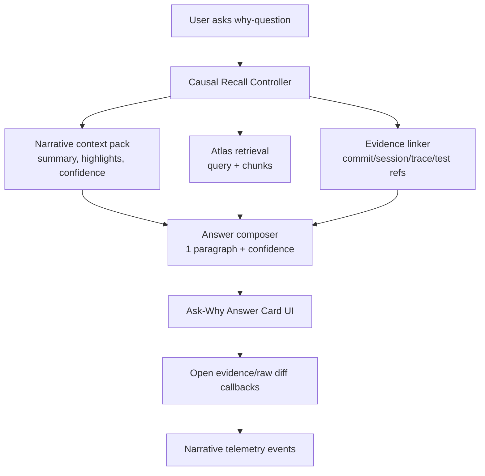

# feat: Add Causal Recall Copilot Ask-Why Answer Card

## Table of Contents
- [Overview](#overview)
- [Deepening Summary](#deepening-summary)
- [Research Consolidation](#research-consolidation)
- [Problem Statement](#problem-statement)
- [Proposed Solution](#proposed-solution)
- [Technical Approach](#technical-approach)
  - [Architecture](#architecture)
  - [Implementation Phases](#implementation-phases)
- [Alternative Approaches Considered](#alternative-approaches-considered)
- [System-Wide Impact](#system-wide-impact)
  - [Interaction Graph](#interaction-graph)
  - [Error & Failure Propagation](#error--failure-propagation)
  - [State Lifecycle Risks](#state-lifecycle-risks)
  - [API Surface Parity](#api-surface-parity)
  - [Integration Test Scenarios](#integration-test-scenarios)
- [SpecFlow / Edge-Case Analysis](#specflow--edge-case-analysis)
- [Open Questions](#open-questions)
- [Acceptance Criteria](#acceptance-criteria)
  - [Functional Requirements](#functional-requirements)
  - [Non-Functional Requirements](#non-functional-requirements)
  - [Quality Gates](#quality-gates)
- [Testing Strategy](#testing-strategy)
- [Success Metrics](#success-metrics)
- [Dependencies & Prerequisites](#dependencies--prerequisites)
- [Risk Analysis & Mitigation](#risk-analysis--mitigation)
- [Resource Requirements](#resource-requirements)
- [Future Considerations](#future-considerations)
- [Documentation Plan](#documentation-plan)
- [Sources & References](#sources--references)

## Overview
Add a **Causal Recall Copilot** that answers branch-scoped “why” questions with a concise paragraph, confidence, and linked evidence (commits, sessions, traces, tests), optimized for returning developers (see brainstorm: docs/brainstorms/2026-03-01-causal-recall-copilot-brainstorm.md).

This plan carries forward all brainstorm decisions: selected Approach A (ask-why answer card), local-first scope, low-confidence fallback behavior, and the north-star metric of faster time-to-understanding (see brainstorm: docs/brainstorms/2026-03-01-causal-recall-copilot-brainstorm.md).

## Deepening Summary
- Deepened focus on deterministic behavior, stale-request safety, and explicit fallback contracts based on existing Atlas and narrative patterns.
- Added cross-layer failure and telemetry parity checks so the feature remains auditable and non-fragile.
- Converted brainstorm non-goals into explicit v1 guardrails to prevent scope creep (see brainstorm: docs/brainstorms/2026-03-01-causal-recall-copilot-brainstorm.md).

## Research Consolidation
### Local repository patterns
- Narrative confidence, fallback messaging, and evidence links already exist in `/Users/jamiecraik/dev/firefly-narrative/src/core/narrative/composeBranchNarrative.ts:152-217`.
- Deterministic summary prioritization already exists in `/Users/jamiecraik/dev/firefly-narrative/src/core/narrative/recallLane.ts:113-136`.
- Recall-lane evidence routing and telemetry context already exist in `/Users/jamiecraik/dev/firefly-narrative/src/ui/components/BranchNarrativePanel.tsx:102-127` and `/Users/jamiecraik/dev/firefly-narrative/src/ui/views/branch-view/useBranchViewController.ts:559-627`.
- Atlas retrieval primitives and stale-request guards already exist in `/Users/jamiecraik/dev/firefly-narrative/src/hooks/useAtlasSearch.ts:49-120` and `/Users/jamiecraik/dev/firefly-narrative/src/ui/components/AtlasSearchPanel.tsx:81-187`.
- Typed Atlas envelopes and budgets exist in `/Users/jamiecraik/dev/firefly-narrative/src/core/atlas-api.ts:10-222`.
- Atlas query constraints and deterministic truncation exist in `/Users/jamiecraik/dev/firefly-narrative/src-tauri/src/atlas/commands.rs:171-203` and `:266-279`.
- Existing right-panel/tab extension surface exists in `/Users/jamiecraik/dev/firefly-narrative/src/ui/components/right-panel-tabs/types.ts:19-33` and `/Users/jamiecraik/dev/firefly-narrative/src/ui/components/right-panel-tabs/RightPanelTabPanels.tsx:235-239`.

### Institutional learnings (`docs/solutions`)
- Deterministic precedence and dedupe are critical to avoid narrative drift (transfer principle) from `/Users/jamiecraik/dev/firefly-narrative/docs/solutions/integration-issues/codex-app-server-claude-otel-stream-reliability-auth-migration-hardening.md:49-67`.
- Fallback runbook behavior should be explicit and fast when quality degrades from `/Users/jamiecraik/dev/firefly-narrative/docs/solutions/integration-issues/codex-app-server-claude-otel-stream-reliability-auth-migration-hardening.md:111-117`.

### External research decision
Skipped external research. This feature is local-first, non-regulatory, and the codebase already has mature patterns for confidence, retrieval, fallback, and telemetry.

## Problem Statement
Narrative currently offers strong building blocks (summary, recall lane, Atlas search, evidence routing) but not a direct “answer my why question” path. Returning developers still manually synthesize intent across multiple panes, increasing time-to-understanding and context-switch cost (see brainstorm: docs/brainstorms/2026-03-01-causal-recall-copilot-brainstorm.md).

## Proposed Solution
Implement a branch-scoped **Ask-Why Answer Card** that:
1. accepts a natural-language “why” question,
2. returns one concise answer paragraph,
3. attaches confidence + uncertainty copy,
4. includes citations that deep-link into existing evidence flows,
5. degrades gracefully to evidence/raw-diff fallback when confidence is low.

The feature remains local-first, avoids new external connectors, and excludes autonomous code changes or heavy timeline tooling in v1 (see brainstorm: docs/brainstorms/2026-03-01-causal-recall-copilot-brainstorm.md).

## Technical Approach

### Architecture


### Implementation Phases
#### Phase 1: Foundation (scope + contracts)
- Define ask-why domain types in `/Users/jamiecraik/dev/firefly-narrative/src/core/types.ts` (question input, answer payload, citation model, confidence band).
- Add question/answer orchestration module (for example `/Users/jamiecraik/dev/firefly-narrative/src/core/narrative/causalRecall.ts`) using existing narrative + Atlas adapters.
- Define telemetry event extensions in `/Users/jamiecraik/dev/firefly-narrative/src/core/telemetry/narrativeTelemetry.ts` for ask-why viewed/submitted/resolved/fallback, including a deterministic `queryId` for dedupe.
- Deliverable: compile-safe type contracts and deterministic ordering/citation rules.

#### Phase 2: Core implementation (UI + orchestration)
- Add Ask-Why Answer Card surface in existing BranchNarrativePanel (`/Users/jamiecraik/dev/firefly-narrative/src/ui/components/BranchNarrativePanel.tsx`) — colocated with narrative context for tight coupling to branch-scope state and evidence handlers. Extraction to a dedicated component is deferred until usage patterns emerge.
- Wire controller in `/Users/jamiecraik/dev/firefly-narrative/src/ui/views/branch-view/useBranchViewController.ts` with branch-scope stale-guard protections matching existing patterns.
- Reuse existing evidence navigation handlers (`onOpenEvidence`, `onOpenRawDiff`) for citations.
- Deliverable: end-to-end user flow from question to answer to evidence click.

#### Phase 3: Polish & optimization (quality + measurement)
- Add test coverage for stale async handling, low-confidence fallback, and citation determinism in:
  - `/Users/jamiecraik/dev/firefly-narrative/src/ui/views/__tests__/BranchView.test.tsx`
  - `/Users/jamiecraik/dev/firefly-narrative/src/ui/components/__tests__/BranchNarrativePanel.test.tsx`
  - new tests under `/Users/jamiecraik/dev/firefly-narrative/src/core/narrative/__tests__/`.
- Add telemetry-derived KPI reporting hooks for time-to-understanding.
- Deliverable: feature-flagged, measurable v1 release candidate.

## Alternative Approaches Considered
- **A) Ask-Why Answer Card (selected):** best value/scope ratio for v1 (see brainstorm: docs/brainstorms/2026-03-01-causal-recall-copilot-brainstorm.md).
- **B) Causal Timeline Explorer (rejected for v1):** richer but heavier and contradicts YAGNI for first release.
- **C) Retrieval-only why search (rejected for v1):** lowest synthesis risk but too much manual interpretation for returning-developer UX goals.

## System-Wide Impact

### Interaction Graph
- Ask action triggers controller in branch view.
- Controller composes context from current narrative state + Atlas search.
- Composer returns answer payload consumed by answer-card UI.
- Citation click calls existing `onOpenEvidence` / `onOpenRawDiff`, which then routes node/file selection and telemetry (`evidence_opened`, `fallback_used`).
- Existing rollout/kill-switch logic remains authoritative for fallback states.

### Error & Failure Propagation
- Atlas envelope errors (`REPO_NOT_FOUND`, `FTS_NOT_AVAILABLE`, `INVALID_QUERY`, `INTERNAL`) should map to non-blocking UI messages and never crash answer card.
- Branch/context mismatches must be dropped using existing scope-guard patterns to avoid stale response overwrite.
- Low-confidence isn’t an error; it is a first-class state with explicit uncertainty + fallback CTA.

### State Lifecycle Risks
- Risk: async answer arrives after branch switch and pollutes current view.
  - Mitigation: branchScopeKey/request-version guards, mirroring Atlas panel and branch controller patterns.
- Risk: duplicated submissions spam telemetry.
  - Mitigation: in-flight request lock + dedupe key per branch+question+minute bucket.
- Risk: partial answer payload (no citations).
  - Mitigation: fallback to raw diff CTA and mark answer as low confidence.

### API Surface Parity
- Maintain parity across:
  - branch narrative panel behavior,
  - Atlas panel retrieval semantics,
  - telemetry schema consumers.
- No v1 backend schema migration required; use existing Atlas and feedback storage.

### Integration Test Scenarios
1. Question asked on branch A, then user switches to branch B before resolution; stale A response must not render.
2. Low-confidence answer must show uncertainty copy and a working raw-diff fallback path.
3. Citation click on commit/session/file routes to correct panel/selection and emits telemetry context.
4. Atlas unavailable (`FTS_NOT_AVAILABLE`) returns graceful degraded state without blocking branch narrative UI.
5. Repeated identical question in short window avoids duplicate telemetry inflation.

## SpecFlow / Edge-Case Analysis
> Note: `spec-flow-analyzer` agent type was unavailable in this environment; manual SpecFlow pass applied.

### Core flow
- Given a loaded repo + branch narrative,
- When user asks a why-question,
- Then app returns concise answer + confidence + citations,
- And user can open cited evidence directly.

### Edge cases
- Empty/whitespace question input.
- Repo not selected.
- Branch with no commits / narrative `failed` state.
- Atlas index missing or stale.
- Conflicting evidence sources (session says X, tests imply Y).
- Kill switch active (answer card should remain read-only + fallback-first).

### Gaps to close in implementation
- Confidence-band policy for answer-level confidence (separate from highlight confidence).
- Citation ranking policy when more than N candidate evidence links are available.
- UX copy standard for “insufficient evidence” vs “low confidence.”

## Key Decisions (v1 Resolved)

> **Note:** The following decisions were promoted from open questions to explicit v1 constraints on 2026-03-02.

| Decision | v1 Choice | Rationale |
|----------|-----------|-----------|
| Citation cap | **3 per answer** | Keeps answer card compact; aligns with existing evidence-link density patterns |
| Interaction model | **Explicit submit-only** | Prevents over-fetching, gives user clear intent signal for telemetry |
| Low-confidence reason codes | **Include standardized code** | Enables segmentation of fallback root causes (e.g., `no_evidence`, `conflicting_signals`, `atlas_unavailable`) |

## Open Questions
> No remaining v1 blockers. See Future Considerations for post-v1 exploration.

## Acceptance Criteria

### Functional Requirements
- [ ] User can submit a branch-scoped why-question from the narrative experience.
- [ ] System returns a 1-paragraph answer with at least one citation when evidence exists (see brainstorm: docs/brainstorms/2026-03-01-causal-recall-copilot-brainstorm.md).
- [ ] Each citation can open existing evidence flows (commit/session/file/diff) without introducing a separate navigation system.
- [ ] Low-confidence answers explicitly indicate uncertainty and offer fallback CTA to raw diff (see brainstorm: docs/brainstorms/2026-03-01-causal-recall-copilot-brainstorm.md).
- [ ] Feature remains local-first and does not call external connectors/services (see brainstorm: docs/brainstorms/2026-03-01-causal-recall-copilot-brainstorm.md).
- [ ] Answer text is grounded: each sentence is attributable to at least one citation or marked as uncertainty.
- [ ] **Citation grounding is machine-checkable**: answer payload includes `sentenceCitationMap: Array<{ sentenceIndex: number; citationIds: string[] }>` enabling automated validation that every sentence has ≥1 citation or is explicitly marked `uncertain: true`.

### Non-Functional Requirements
- [ ] Deterministic answer/citation ordering for identical inputs.
- [ ] Async stale-response safety under rapid branch switching.
- [ ] Accessibility: keyboard reachable controls, semantic labels, and readable confidence state text.
- [ ] Performance: answer interaction should not regress branch-view responsiveness.

### Quality Gates
- [ ] `pnpm test` passes.
- [ ] `pnpm test:deep` passes (source/runtime behavior changes).
- [ ] New tests added for stale async guard, confidence fallback, and citation routing.
- [ ] Telemetry events documented and validated in test assertions where applicable.

## Testing Strategy
- Unit tests:
  - answer composition ranking and confidence band mapping in `/Users/jamiecraik/dev/firefly-narrative/src/core/narrative/__tests__/causalRecall.test.ts`.
  - citation normalization/fallback behavior in `/Users/jamiecraik/dev/firefly-narrative/src/core/narrative/__tests__/causalRecall.test.ts`.
  - **Citation grounding validation:** assert `sentenceCitationMap` has entry for every sentence index, and each entry has ≥1 `citationId` or `uncertain: true` flag.
- Component tests:
  - ask input, answer rendering, low-confidence state, and CTA behavior in `/Users/jamiecraik/dev/firefly-narrative/src/ui/components/__tests__/BranchNarrativePanel.test.tsx`.
- Controller integration tests:
  - stale branch-switch response suppression and telemetry payload assertions in `/Users/jamiecraik/dev/firefly-narrative/src/ui/views/__tests__/BranchView.test.tsx`.
- Regression tests:
  - preserve Atlas tab behavior in `/Users/jamiecraik/dev/firefly-narrative/src/ui/components/__tests__/AtlasSearchPanel.test.tsx`.

## Success Metrics

### Primary Metric (from brainstorm): **reduced time-to-understanding**

**KPI Computation Rule:**
```
time_to_understanding = ts_understanding_action - ts_branch_view_open
```

Where `ts_understanding_action` is the earlier of:
1. `answer_viewed` telemetry event timestamp (user scrolled answer into viewport for ≥2s), OR
2. `evidence_opened` telemetry event timestamp (user clicked a citation from the answer card)

**Required Telemetry Events:**

| Event Name | Required Payload Fields | Emitted When |
|------------|------------------------|--------------|
| `ask_why_submitted` | `queryId: string`, `branchId: string`, `questionHash: string` (first 8 chars of SHA256) | User submits question |
| `ask_why_answer_viewed` | `queryId`, `confidence: 'high' | 'medium' | 'low'`, `citationCount: number`, `fallbackUsed: boolean` | Answer card visible in viewport ≥2s |
| `ask_why_evidence_opened` | `queryId`, `citationType: 'commit' | 'session' | 'file' | 'diff'`, `citationId: string` | User clicks citation link |
| `ask_why_fallback_used` | `queryId`, `reasonCode: 'no_evidence' | 'conflicting_signals' | 'atlas_unavailable' | 'low_confidence_override'` | User clicks raw-diff fallback CTA |
| `ask_why_error` | `queryId`, `errorType: string` (Atlas error code or internal) | Answer generation fails |

**KPI Reporting Query:**
```sql
-- Median time-to-understanding per branch session
SELECT
  percentile_cont(0.5) WITHIN GROUP (ORDER BY
    EXTRACT(EPOCH FROM (first_understanding_action - branch_view_open))
  ) as median_seconds
FROM branch_sessions
WHERE first_understanding_action IS NOT NULL
  AND created_at >= :reporting_window_start;
```

### Secondary Guardrails
- **Fallback usage rate:** `(ask_why_fallback_used events) / (ask_why_answer_viewed events)` — should be elevated for low-confidence answers, not universally high
- **Citation open-through rate:** `(ask_why_evidence_opened events) / (ask_why_answer_viewed events)` — indicates answer relevance
- **Error rate:** `(ask_why_error events) / (ask_why_submitted events)` — should remain <5%

## Dependencies & Prerequisites
- Existing narrative composition + recall lane modules.
- Atlas search/index availability for repo.
- Existing branch-view telemetry pipeline.
- Feature flag strategy (recommended) for staged rollout.

## Risk Analysis & Mitigation
- **Risk:** Answer overstates certainty.  
  **Mitigation:** enforce confidence-banded copy and low-confidence fallback behavior by contract.
- **Risk:** Retrieval noise causes misleading citations.  
  **Mitigation:** deterministic ranking + limited top citations + no-citation fallback state.
- **Risk:** UI complexity creep toward timeline product.  
  **Mitigation:** hold strict v1 non-goals (no heavy forensics timeline).

## Resource Requirements
- 1 frontend engineer (UI + controller wiring).
- 1 platform/full-stack engineer (Atlas/retrieval integration + telemetry contract checks).
- Optional design pass for answer-card affordances and copy clarity.

## Future Considerations
- Causal timeline explorer (deferred, see rejected Approach B in brainstorm).
- Team/reviewer-specific answer personas.
- Cross-branch comparative “why changed between branches” mode.

## Documentation Plan
Update after implementation:
- `/Users/jamiecraik/dev/firefly-narrative/README.md` (feature highlight and usage).
- `/Users/jamiecraik/dev/firefly-narrative/docs/README.md` (new capability index entry).
- `/Users/jamiecraik/dev/firefly-narrative/docs/agents/testing.md` if new test commands or test slices are introduced.
- Add a solution note under `/Users/jamiecraik/dev/firefly-narrative/docs/solutions/` for rollout learnings.

## Sources & References
### Origin
- **Brainstorm document:** `/Users/jamiecraik/dev/firefly-narrative/docs/brainstorms/2026-03-01-causal-recall-copilot-brainstorm.md`  
  Key decisions carried forward: returning-developer focus, ask-why answer card, low-confidence fallback, time-to-understanding KPI.

### Internal References
- Narrative model + confidence/fallback: `/Users/jamiecraik/dev/firefly-narrative/src/core/narrative/composeBranchNarrative.ts:152-217`
- Recall-lane derivation: `/Users/jamiecraik/dev/firefly-narrative/src/core/narrative/recallLane.ts:113-136`
- Narrative panel recall-lane UX: `/Users/jamiecraik/dev/firefly-narrative/src/ui/components/BranchNarrativePanel.tsx:102-200`
- Branch controller orchestration + telemetry: `/Users/jamiecraik/dev/firefly-narrative/src/ui/views/branch-view/useBranchViewController.ts:215-227` and `:559-627`
- Atlas API contract: `/Users/jamiecraik/dev/firefly-narrative/src/core/atlas-api.ts:10-222`
- Atlas UI + stale-guard patterns: `/Users/jamiecraik/dev/firefly-narrative/src/ui/components/AtlasSearchPanel.tsx:81-187`
- Atlas hook stale-request handling: `/Users/jamiecraik/dev/firefly-narrative/src/hooks/useAtlasSearch.ts:49-120`
- Atlas query constraints/budgets: `/Users/jamiecraik/dev/firefly-narrative/src-tauri/src/atlas/commands.rs:171-203` and `:730-763`
- Existing Atlas tests: `/Users/jamiecraik/dev/firefly-narrative/src/ui/components/__tests__/AtlasSearchPanel.test.tsx:130-260`, `/Users/jamiecraik/dev/firefly-narrative/src/hooks/__tests__/useAtlasSearch.test.ts:83-207`

### Institutional Learnings
- Deterministic precedence + fallback discipline: `/Users/jamiecraik/dev/firefly-narrative/docs/solutions/integration-issues/codex-app-server-claude-otel-stream-reliability-auth-migration-hardening.md:49-67` and `:111-117`

### Related Work
- Prior recall lane plan: `/Users/jamiecraik/dev/firefly-narrative/docs/plans/2026-02-27-feat-add-recall-lane-comprehension-plan.md`
